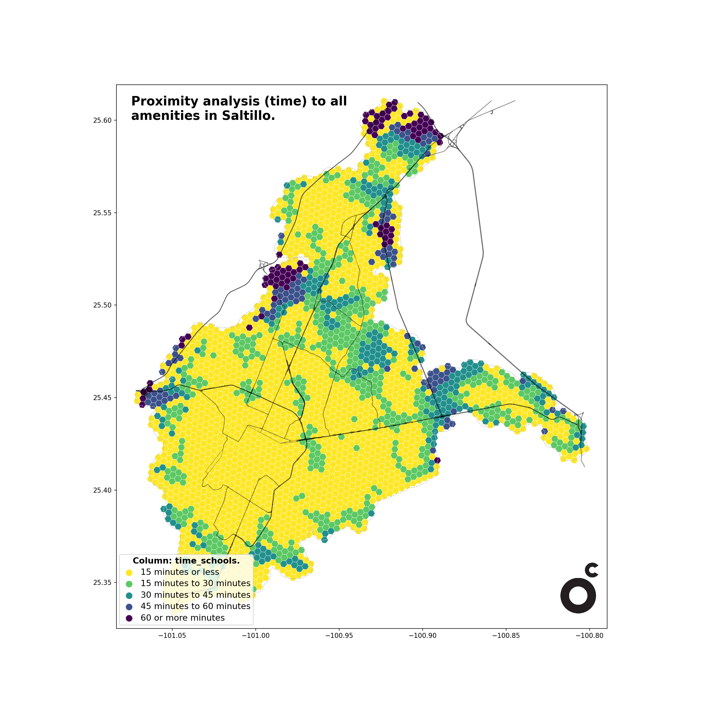
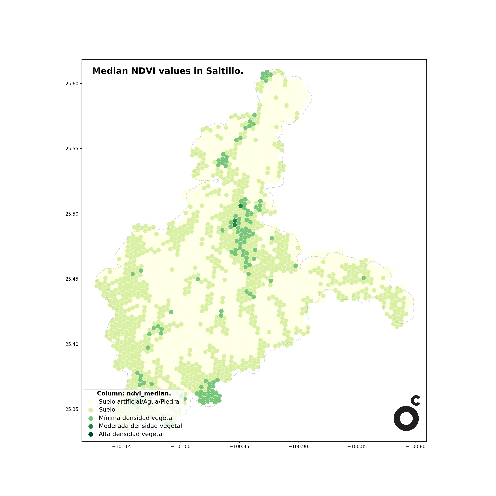
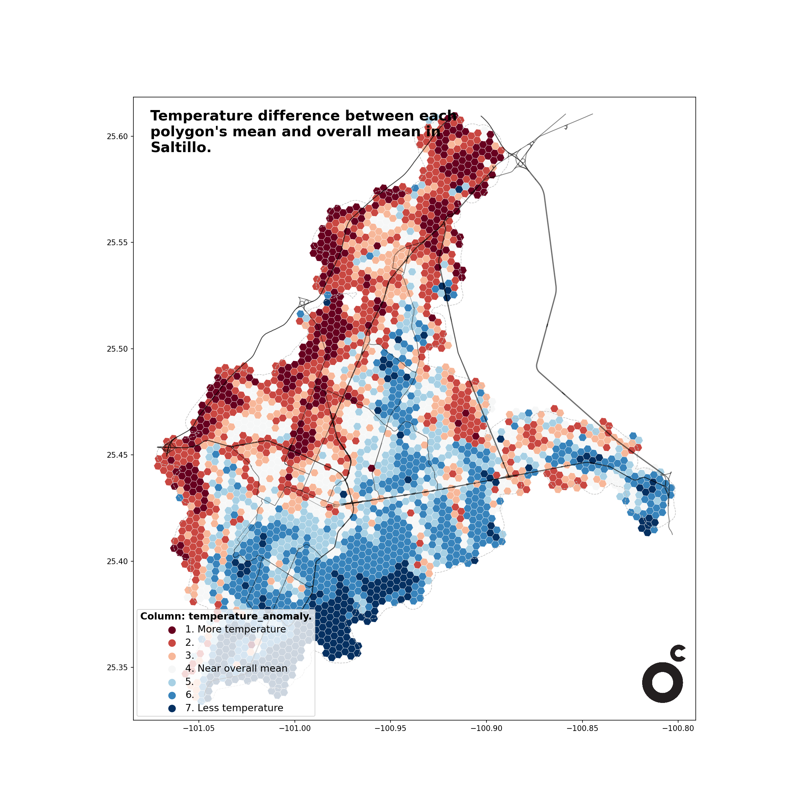

# OdC

The OdC (Observatorio de Ciudades) is an urban science laboratory focused on innovation in the collection, processing, analysis and visualization of spatial data related to urban dynamics.
This Python package provides a low-code toolkit for spatial analysis.
It integrates well-known geospatial libraries and adds first-party functions developed for faster, reproducible workflows.

------------

# Installing the package

```python
pip install odc
```
------------

# Spatial analyisis processess demonstrations

Three demo files were prepared to display the basic usage of some package functions and classes. These are the developed demos:

* [Demo 01 - Proximity analysis](demo/Demo_01-Proximity_analysis.ipynb)
  * Calculates and displays how close or accessible certain locations are to others within a defined area.
  * Input files required: Area of interest and points of interest.
  
  
  
* [Demo 02 - NDVI raster analysis](demo/Demo-02-NDVI_raster_analysis.ipynb)
  * Calculates and displays a Normalized Difference Vegetation Index (NDVI) analysis, a spectral index that measures vegetation greenness and vigor.
  * Input files required: Area of interest.

  
  
* [Demo 03 - Land Surface Temperature analysis](demo/Demo_03-Land_Surface_Temperature_analysis.ipynb)
  * Calculates and displays a Land Surface Temperature (LST) analysis, representing the thermal emission from the Earth's surface. Indicates how hot the surface of the land would feel to the touch.
  * Input files required: Area of interest.

  

The demos can be found on the [demo](demo/) folder, while the used input and outputs can be found on the [data/demo_files](data/demo_files/) folder.

------------
